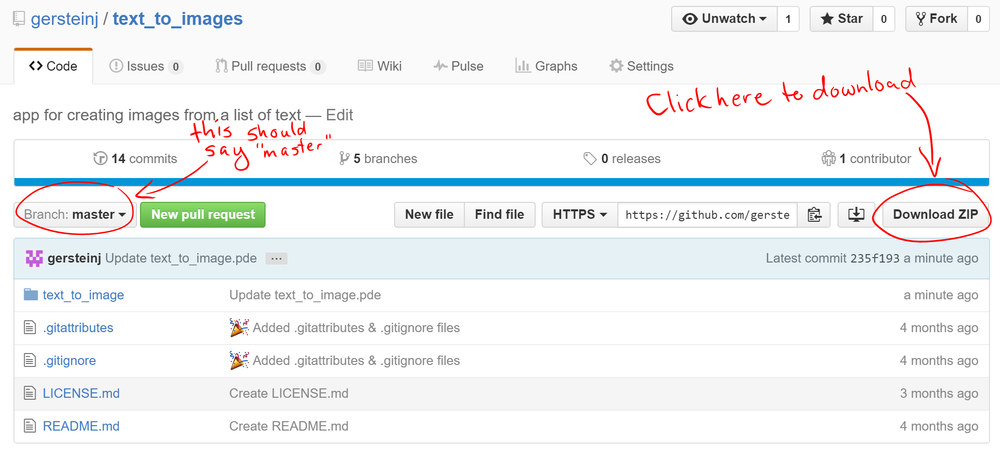

# Text To Images

## Important Message
* Please do not distribute this program yourself. If you have friends who want to use it, please direct them here so they can get the updated version as I continue to improve it. I'm almost done putting together a graphical interface and standalone application, which will make this much easier to use. You can send them to this page or to my [website](http://www.robotsinheels.com), which has a link to access this page as well.
* If you have questions or suggestions, please reach out to me at gersteinj@gmail.com or as @gersteinj on Twitter. Feel free to get hold of me here, too, if you're comfortable with Git/GitHub.

## Getting Started
* This program doesn't have a graphical interface or standalone application yet, so you'll need to download the Processing IDE to run it. Go to [Processing.org](http://www.processing.org) and install the appropriate version for your computer (Windows/Mac/Linux are all available).
* Download the zipped folder containing the program - the image below highlights the location of the download button 
* Unzip the folder you just downloaded - the exact procedure varies by operating system. In most versions of Windows, you can do this by right clicking on the folder, choosing "Extract all..." from the menu that comes up, and following directions
* To run the program, open "text_to_images.pde" in Processing

## Preparing Your Word List
* You'll need a text file in UTF-8 encoding, with each word/phrase on a single line. If that made sense, you can skip the rest of this section and just set up your file. Otherwise, the next few steps are for you.
* Open up a text editor. I like Notepad++, but any text editor should work. The default for OSX is Textedit, and the default for Windows is Notepad. The default for Linux depends on the variety of Linux you have - a quick search should help if you don't know what text editor you have installed.
* Set up your word list. Remember, each line will become an image file.
* Save your file somewhere that you can find it again. Make sure your file has UTF-8 encoding. In most text editors, there should be an option to set the encoding as part of the save dialog.

## Settings
* When you run the file you downloaded, my code will open. Until the graphical interface is ready, you'll have to change settings manually
* Only a small portion of the code is meant to be edited by the user
* Replace "text" with whatever file name you want, in quotes. The program will add numbers so the files don't have the same names
* Replace 60 for the height of the text if you don't like the size of the text
* Replace 300 and 200 for the size of the image output if you want to change the image size
* If you want to change the color of the background or text, the colors are given as red, green, and blue with a range from 0 to 255. A color picker can help you figure out the values you want.

```java
//Replace "text" with whatever you want the name of the files to be
//Make sure your filename is in quotes
//Files will be named in the following format: name + number + .png
String fileName = "text";

//Height of text in pixels
int sizeOfText = 60;

//Size of image output
int graphicW = 300;
int graphicH = 200;

//Colors of text and background, given as (red, green, blue). Default is black text on white background
color textColor = color(0, 0, 0);
color bgColor = color(255, 255, 255);
```

## Getting Your Images
* Run the program (click the play button - it's in the top left corner and has a triangle on it)
* When prompted, pick your word list. A sample word list has been provided for testing.
* The window that opened when you ran the program will close, and your images will be in the folder containing the code.
